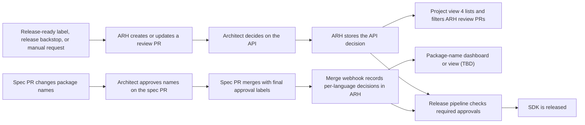

# ARH as the Shared Record for SDK Architecture Approvals

> **Status:** Working draft. This document separates established behavior from the
> decisions still needed before API Review Hub (ARH) can replace APIView and SDK
> review issue tracking.

---

## Goal

Use ARH as the shared record for SDK API and package-name approvals.

The approval actions remain in the GitHub PR where each review happens:

- Architects approve the SDK API on the ARH review PR.
- Architects approve package names on the `azure-rest-api-specs` PR.

ARH stores both decisions and makes their status available to architect dashboards
and release pipelines. Spec-less package handling, approval reuse, and dashboard
display are still open.

The new process should:

- keep release-facing approval records in one place;
- give architects a clear review queue;
- remove duplicate tracking in SDK review issues;
- work for generated and manually written SDKs;
- group related language packages under one service;
- show package names that need approval and names approved earlier; and
- block release when required approval is missing.

---

## Terms

- **Working PR:** The SDK pull request that will be merged and released.
- **Review PR:** The pull request created by ARH for reviewing the SDK API. It uses
  temporary branches and does not change the SDK repository.
- **API hash:** An ID for the exact SDK API that was reviewed. If the API changes,
  the old approval no longer applies.
- **SDK review issue:** The current issue in `Azure/azure-sdk` used to collect
  review links, group languages, and show review status.
- **ARH Service and Package:** ARH groups related Packages under a Service.
- **Status label:** A GitHub label such as `api-approved` that shows ARH state. The
  label is not the approval record used for release.

---

## Decisions at a glance

**Priority**

- **P0:** Must be decided before the old review process can be removed.
- **P1:** Needed for the complete architect experience, but does not block basic ARH
  approval storage and release checks.

| # | Priority | Decision | What is already known |
|---|----------|----------|-----------------------|
| [1](#decision-1) | P0 | Finalize the release-ready trigger and which release types it supports. | Preferred flow: working PR label, release-pipeline backstop, and agent or CLI for custom requests. |
| [2](#decision-2) | P0 | Decide package-name handling for spec-less SDKs and finalize approval reuse. | A spec PR merge webhook records final per-language labels on ARH Packages. |
| [3](#decision-3) | P0 | Decide whether SDK review issues can be removed and how meeting requests work afterward. | ARH already groups Packages under a Service and stores API decisions. |
| [4](#decision-4) | P1 | Finish the architect dashboard design, including package-name work. | [Project view 4](https://github.com/orgs/Azure/projects/1018/views/4) is the ARH review PR queue. |
| [5](#decision-5) | P1 | Finalize SDK API status labels and architect authorization. | GitHub review activity triggers ARH; ARH stores the decision and updates labels. |
| [6](#decision-6) | P1 | Finalize when review PRs close and whether long-running reviews are supported. | Reviews are on demand by default; long-running reviews should be exceptional. |

---

## Approval authority and source of truth

### Today

- APIView is the SDK API approval record used by release pipelines.
- SDK review issue labels such as `<lang>-api-approved` are informational.
- Package-name approval happens on the `azure-rest-api-specs` PR. Protected labels
  and a required GitHub check block the spec PR until required architects approve.

### Target

ARH becomes the shared record used by release pipelines.

For SDK API approval:

- The architect decides on the ARH review PR.
- ARH stores the API hash, decision, architect, language, package, working PR, and
  decision time.

For package-name approval:

- The architect decides on the `azure-rest-api-specs` PR.
- The existing workflow verifies the architect.
- After merge, ARH stores each language's decision on the corresponding Package and
  links to the spec PR as evidence.
- The architect does not approve the package name again in ARH.

SDK API approval applies only to its API hash. A changed SDK API has a new hash and
requires approval. When the hash is unchanged, approval carry-forward follows the
policy configured for that language repository during ARH registration. Languages
can choose different policies.

Questions answered by the current design:

- **Question:** What is the authoritative SDK API approval record today?

  **Answer:** APIView. SDK review issue labels are informational, and release does
  not consult GitHub or Azure DevOps for SDK API approval.

- **Question:** How do release pipelines transition from APIView to ARH?

  **Answer:** The new release components use `azsdk` commands that query APIView or
  ARH. This provides compatibility while languages onboard to ARH.

- **Question:** How does ARH prevent approval from applying after the API changes?

  **Answer:** The language repository submits the exact API hash. A changed surface
  produces a different hash, so the approval check fails. ARH can show approved
  hashes to a person, but CI still fails for the unapproved hash.

- **Question:** Does APIView also gate directly on the submitted API hash?

  **Answer:** Not directly. The APIView release check finds a matching package and
  version. APIView uses the hash internally to copy approval from an older version
  when the API is unchanged. ARH instead requires the release check to submit the
  exact hash.

- **Question:** Can an unchanged API hash reuse approval for another package
  version?

  **Answer:** Yes, when allowed by that language repository's ARH policy. A changed
  hash is never approved through carry-forward.

---

## Decision 1 (P0): How does SDK API review start?

The preferred normal trigger is a release-ready label on the working SDK PR. This
works for TypeSpec-generated, otherwise generated, and manually written SDKs.

The label path is a shortcut. It cannot provide every argument accepted by
`azsdk api-review create`, so it uses a standard comparison:

- For a normal GA release, compare against the latest GA.
- For a first GA, compare against no previous GA.
- Post a working PR comment that identifies the selected baseline.
- Direct the user to the Azure SDK agent or `azsdk` command when another baseline is
  needed.

If a team merges without requesting review, the release pipeline is the backstop.
When its approval check finds no approval and no open review, it creates a review.
After approval, rerunning the approval job continues the release.

The agent or CLI remains the explicit path for beta reviews, unusual baselines, and
other custom requests.

Today, authorized CoreAI users can call `azsdk api-review create`. The command
requires:

- language;
- package name;
- target branch;
- optional base tag or ref;
- target owner, which defaults to `Azure`; and
- target repository, which ARH can choose from the language.

Calling ARH again for the same package, base, and target returns the existing review
instead of creating a duplicate.

| Entry point | Purpose | Status |
|-------------|---------|--------|
| Release-ready label on the working SDK PR | Normal pre-merge request | Preferred direction |
| Release pipeline approval check | Backstop after merge when no review exists | Preferred direction |
| `azsdk` or Azure SDK agent request | Custom baseline, beta, or exceptional flow | Existing explicit path |
| Release planner guidance | Tell the service team what agent request to run | Read-only guidance, not an action |
| Automated release flow | Possible future trigger | Interaction with the label flow is not defined |

The decision must cover:

- [ ] What is the final label name: `release-ready`, `ga-release-ready`, or another
  name?
- [ ] Does the label support GA only, first beta and GA, or every requested beta
  and GA?
- [ ] For a beta label, does ARH compare against the latest beta, latest GA, or
  reject the shortcut and direct the user to the agent or CLI?
- [ ] Do management plane auto-release and other automated release flows apply the
  label, call ARH directly, or rely on the release-pipeline backstop?
- [ ] Do no-spec-change and team-specific handoff flows need different behavior?

Questions answered by the current implementation:

- **Question:** Who is authorized to request a review?

  **Answer:** Anyone in the CoreAI security group can reach the create endpoint.

- **Question:** Who is authorized to cancel or restart a review?

  **Answer:** Cancel and restart are not ARH operations.

- **Question:** Who can close a review PR?

  **Answer:** Anyone with the required GitHub repository permission.

- **Question:** Does a new commit update the existing review or create another one?

  **Answer:** A target-branch commit updates the existing review when it changes the
  API diff. It never creates another review.

- **Question:** What happens when the same package, base, and target are requested
  again?

  **Answer:** The create endpoint returns the existing review PR instead of creating
  a duplicate.

- **Question:** Is ARH limited to TypeSpec or release-agent SDKs?

  **Answer:** No. ARH is independent of TypeSpec and the release agent. Generated,
  manually written, and locally generated paths can use the same create endpoint.

- **Question:** What information does a caller have to provide?

  **Answer:** Language, package name, and target branch are required. The caller can
  also provide a base tag or ref and target owner. ARH can infer the repository from
  the language.

- **Question:** Who produces the API artifact and hash for generated and
  non-generated SDKs?

  **Answer:** The language repository controls artifact generation and defines the
  API hash for its language. ARH is not dependent on how the SDK was produced.

- **Question:** Who owns failures that prevent creation of a reviewable artifact?

  **Answer:** The ARH team owns failures in ARH or shared language-independent
  templates. The language team owns failures in language-specific components.

- **Question:** What is the manual backup when the label's baseline is not correct?

  **Answer:** Use the Azure SDK agent or `azsdk api-review create` and supply the
  desired base explicitly.

- **Question:** What happens if the team reaches the release pipeline without
  requesting a review?

  **Answer:** The approval check can create the missing review. The team gets the
  approval and reruns that job to continue.

- **Question:** Are “review requested” and “release ready” different for the normal
  flow?

  **Answer:** No. The preferred label represents readiness for the review required
  to release.

All entry points should use the existing create operation. Review PR closing and
reopening behavior is covered in [Decision 6](#decision-6).

---

## Decision 2 (P0): How is package-name approval mapped and reused?

### Current GitHub process

The [package-name review
process](https://github.com/samvaity/azure-rest-api-specs/blob/bbd22cbebd12870570ea5795ff10c45ae5b83522/.github/workflows/src/package-name-approval/PACKAGE-NAME-REVIEW-PROCESS.md)
runs on the spec PR:

- A workflow finds new or changed package names in `tspconfig.yaml`.
- If any name changes, all Tier 1 language architects approve the cross-language
  name set.
- The PR comment shows changed names, configured but unchanged names, and languages
  not yet configured.
- Architects approve with protected GitHub labels.
- A required check blocks merge until all required approvals are present.
- If a name changes again on the same PR, only that language's approval is removed.

This process blocks the spec PR and remains separate from later SDK API review.

### Intended ARH result

The architect continues to approve on the GitHub spec PR. ARH stores the verified
result, and `azsdk package get-approval-status` returns it to the release pipeline.
The existing GitHub check continues to gate the spec PR.

ARH waits for the spec PR merge webhook rather than recording every label event.
After merge, it reads the final per-language approval labels and records each
language's package-name approval on the corresponding ARH Package. Waiting for
merge avoids repeated writes when labels are added, removed, and added again.

The record should include:

- approved status for the language Package;
- a link to the merged spec PR as evidence; and
- enough Package identity to return the approval during release.

Package-name approval is stored on the Package, not a Version. An ARH Package has a
package name, language, and optional parent Service. Package versions are separate.

Existing package-name approvals should be backfilled from APIView. Because those
approvals may predate the GitHub process, their evidence can state that they were
copied from APIView instead of linking to a spec PR.

If old approval is reused, the GitHub table could show:

| ARH state | Display | Architect action |
|-----------|---------|------------------|
| New, changed, or not approved | Pending | Review and approve on the spec PR |
| Exact name approved earlier | Approved, greyed out | No action unless the full cross-language set must be confirmed again |
| Language not configured | Not configured, greyed out | Decision needed |

The decision questions and answers are:

- [x] Where does package-name approval happen, and where is it stored?

  **Answer:** The architect approves by adding the approved label on the
  `azure-rest-api-specs` PR. The durable approval record lives in ARH on the
  corresponding Package.

- [x] Which event records approval in ARH?

  **Answer:** The spec PR merge webhook. ARH then reads the final per-language
  approval labels and records them.

- [x] Does ARH participate in the spec PR merge check, or only store the result for
  release?

  **Answer:** The existing REST API specs workflow continues to gate the spec PR.
  ARH stores the result that the later SDK release gate queries.

- [ ] What fields identify reusable approval: Service, language, and exact package
  name, or more?

  **Known:** Package-name approval belongs to an ARH Package identified by package
  name and language, with an optional parent Service. It is not tied to a Version.
  The exact reuse rules are still open.

- [x] How are existing approvals imported into ARH?

  **Answer:** Run a migration script that reads package-name approval from APIView.
  The imported record notes APIView as its evidence.

- [ ] When one language's name changes, must all Tier 1 languages approve again?
- [ ] If they must, how does a greyed-out old approval show that confirmation is
  still needed?
- [ ] What does an architect approve for a Tier 1 language not yet configured?
- [ ] Does ARH keep an old name's approval as history after the name changes?
- [x] Are protected labels still the GitHub approval action? If not, what replaces
  them?

  **Answer:** Yes. The protected per-language labels remain the GitHub approval
  action. ARH reads their final state when the spec PR merges.

- [ ] How does the package-name process find the correct ARH Service and Package?

  **Known:** ARH Packages are identified by package name and language and can have
  an optional Service ID. The exact mapping from the spec PR is still open.

- [x] How does the release pipeline read package-name approval?

  **Answer:** It queries ARH through `azsdk package get-approval-status`, alongside
  SDK API approval.

- [x] Does a separate package-name dashboard prevent ARH from storing the
  approval?

  **Answer:** No. A separate Project view can present the work while ARH remains the
  release-facing record.

- [x] What evidence is stored with a new package-name approval?

  **Answer:** A link to the merged spec PR.

- [x] How should a package with no known approval be treated?

  **Answer:** Treat it like a new package that still needs package-name approval.

- [x] What happens when an SDK review is requested for a Package not yet in ARH?

  **Answer:** ARH creates the Package and then creates its review PR.

### Spec-less SDK packages

When a review is requested for a package that is not yet in ARH, ARH creates the
Package and then creates the review PR. This does not answer where its package name
should be approved when no REST API spec exists.

Two options remain:

| Option | Benefit | Concern |
|--------|---------|---------|
| Approve the package name with the API on the ARH review PR | No artificial spec-repository entry; the review PR is the evidence | Creates a second package-name approval path and has no cross-language view |
| Register the package under `azure-rest-api-specs` even without a spec | Keeps one approval location and supports cross-language discussion | Requires an artificial repository entry for a language-specific utility package |

If the review PR is used, GitHub approval would approve both the API and package
name only after ARH verifies that the package truly has no associated spec.

Open questions:

- [ ] Do spec-less packages require cross-language package-name consensus?
- [ ] How does ARH reliably determine that a package has no associated spec?
- [ ] Which of the two approval locations should architects use for spec-less
  packages?

---

## Decision 3 (P0): Can SDK review issues be removed?

The issue currently:

| Purpose | ARH replacement |
|---------|-----------------|
| Starts review | Decision 1 trigger |
| Collects review links | ARH links the working PR and review PR |
| Groups languages | ARH Service with child Packages |
| Assigns architects | ARH reviewer assignment |
| Shows status | ARH labels and Project view |
| Keeps discussion history | ARH review PR |
| Supports Bookings and meetings | Not decided |

The replacement must continue showing:

- service name;
- packages and languages in the review;
- working and review PRs;
- assigned architects;
- status for each package and language;
- supporting links; and
- meeting request and meeting details when needed.

The decision must cover:

- [ ] Is an issue still needed to request review or communicate with the service
  team?
- [ ] Do reviews already scheduled through Bookings finish through the old process
  or move into ARH?
- [ ] How does a service team request a live architect meeting after issues are
  removed?
- [ ] Where are the meeting date, link, agenda, packages, and outcome recorded?
- [ ] Is the final decision after a meeting always stored in ARH?
- [ ] Should old issues remain as read-only history?
- [ ] How long do both processes run before new issues stop?

Questions answered by the current models:

- **Question:** Did the SDK review issue provide an authoritative approval?

  **Answer:** No. The issue never had approval capability; its labels were
  informational.

- **Question:** Can ARH preserve the service-level grouping currently shown by one
  multi-language issue?

  **Answer:** Yes. ARH has a top-level Service with child Packages, so related
  language packages can be grouped under one service.

If the issue remains required for intake or communication, teams still have two
places to track one review.

Deferred architecture concerns do not require the review PR to stay open. A normal
tracking issue can carry work postponed to a later minor or major release. This is
separate from retaining the current SDK review issue as the review workflow.

---

## Decision 4 (P1): What appears on the architect dashboard?

The [ARH Project view](https://github.com/orgs/Azure/projects/1018/views/4) is the
cross-repository queue for ARH review PRs. Each item is an ARH review PR from a
language repository.

The proposed labels show review state:

| Review PR label | Meaning in the Project view |
|-----------------|-----------------------------|
| `api-review-needed` | Waiting for an architect |
| `api-changes-requested` | Waiting for service-team changes |
| `api-approved` | Approved |

Review PR labels support Project filtering. Working PR labels show the same state to
the service team but are not approval records. The Project `Status` field, such as
`Done`, is not approval and should be hidden if it adds no separate value.

ARH can also show package-name approval on both the review PR and working PR. That
status is informational and should link to the evidence spec PR when one exists.
Architects still perform the package-name approval on the spec PR.

ARH already groups Packages under a Service. A proposed display is to put the
Service name in each review PR title for text filtering. If titles are used, ARH
must correct manual edits.

Architects should not need to open Azure DevOps release-plan work items.

The decision must cover:

- [ ] Is the Service shown in the review PR title, a protected label, or a Project
  field?
- [ ] How are package-name reviews linked to the ARH Service?
- [ ] Are package-name reviews another view in this Project or a separate queue?
- [ ] What package-name status is shown: pending, approved earlier, or not
  configured?

Questions answered by the current dashboard design:

- **Question:** Where are production ARH review PRs hosted?

  **Answer:** In the language repositories.

- **Question:** How can architects filter by language?

  **Answer:** The repository can serve as the language because each language has its
  own repository.

- **Question:** Do architects need Azure DevOps release-plan work items?

  **Answer:** No. Release plans are for service teams and should not be required for
  architect review.

- **Question:** Can the Service name be used to group or filter review PRs?

  **Answer:** Yes. Each Package has a Service parent, and the unique Service name can
  appear in review PR titles for Project text filtering. If titles are used, manual
  edits need anti-tampering handling.

- **Question:** How can multiple reviews for the same Service be distinguished
  without relying on release plans?

  **Answer:** The suggested correlation is
  `service_id + package_version_api_version`. Architects should not need
  release-plan data.

- **Question:** Are labels or Project fields used for review-state filtering?

  **Answer:** Review PR labels are the current routing and filtering mechanism.

- **Question:** Does the Project `Done` status mean API approval?

  **Answer:** No. Approval is shown by `api-approved`; the `Done` field should be
  removed if it has no other meaning.

- **Question:** How are existing review PRs added to the Project?

  **Answer:** The current proof of concept requires them to be added manually.

- **Question:** Can package-name approval be shown on the review and working PRs?

  **Answer:** Yes. ARH can apply informational status labels to both and link to the
  evidence used for the recorded decision.

---

## Decision 5 (P1): What SDK API labels and architect rules are used?

SDK API approval happens on the ARH review PR. GitHub review activity triggers an
ARH webhook. ARH checks the reviewer, stores the decision for the API hash, and
updates labels.

Only one state label should be present. If the API hash changes, `api-approved` is
removed.

A normal SDK implementation approval is not an API approval. ARH counts only
decisions from an authorized architect on the ARH review PR.

API and package-name status labels on ARH and working PRs are controlled by ARH.
If someone applies one manually, ARH should remove it and comment with a link to the
correct approval process.

The decision must cover:

- [ ] Are `api-review-needed`, `api-changes-requested`, and `api-approved` the final
  label names?
- [ ] Does any language repository already use those names differently?
- [ ] Where is the authorized architect list stored?
- [ ] How are backup reviewers handled?

Questions answered by the current implementation:

- **Question:** Where does `changes requested` come from?

  **Answer:** Native GitHub review activity triggers an ARH webhook. ARH responds to
  that state and manages the labels.

- **Question:** Are labels needed on both the review PR and working PR?

  **Answer:** Yes. Review PR labels support architect dashboard filtering. Working
  PR labels communicate the state to the service team.

- **Question:** Is a separate `approved-with-comments` state needed?

  **Answer:** No. A GitHub approval may include comments, but approval means the API
  is approved. Work intentionally postponed to a future release belongs in a
  tracking issue.

---

## Decision 6 (P1): When do review PRs close?

ARH keeps one review PR for the same package, base, and target:

- Repeating the same create request returns the existing review PR.
- A target-branch commit updates the review only when the SDK API diff changes.
- ARH never creates another review for that same request.
- The request can specify the release tag or ref used for comparison.
- GitHub preserves review comments.
- A person with GitHub permission can close the review PR.
- Merging the temporary review branches has no effect on SDK code, so the review PR
  should be closed instead.

Reviews should remain on demand by default. Keeping a permanent review open for
every Package would create too many PRs and cause broad repository changes to
refresh many reviews at once.

ARH supports multiple reviews with the same target and different baselines. A
target update refreshes each review whose API diff changes. ARH should not close the
other reviews automatically because an architect may intentionally compare the same
target against the latest GA and latest beta.

Putting several baseline comparisons into one review PR was also explored but is
not the preferred design. It makes the version being reviewed less obvious and
requires substantial changes to the review artifact.

The preferred lifecycle is:

- A review targeting a working branch closes automatically when that branch merges.
- A review targeting `main` remains open until someone closes it manually.
- Closing a review deletes its synthetic branches.
- A long-running `main` review may be created by an architect for a small number of
  problem services, but it is not the default workflow. It uses a released version
  as the base and updates as package changes merge into `main`.

Questions answered by the current implementation:

- **Question:** Can the review PR be merged?

  **Answer:** Technically yes, but it only merges the review branch into a synthetic
  base branch. It does not change SDK code, and both temporary branches are
  eventually deleted.

- **Question:** Does each target branch keep one review PR as feedback is addressed?

  **Answer:** Yes. Changes pushed to the target branch update the existing review PR
  when they change the API diff.

- **Question:** What identifies the baseline for the API diff?

  **Answer:** The caller supplies the base tag or ref. A skill or agent may infer it
  on the caller's behalf.

- **Question:** How are review comments preserved when the API diff changes?

  **Answer:** GitHub preserves them on the existing review PR.

- **Question:** Does APIView remain after ARH migration?

  **Answer:** No. APIView is deleted after every language is onboarded to ARH.

- **Question:** Are reviews on demand or permanently open for every Package?

  **Answer:** On demand by default. Long-running reviews are an exceptional option
  for selected services.

- **Question:** What happens when several reviews use different baselines but the
  same target?

  **Answer:** They remain separate, and a target change updates each affected
  review. Approval of the target API hash satisfies the approval check regardless
  of which baseline review produced it.

- **Question:** How are concerns deferred to a later release preserved?

  **Answer:** Use a tracking issue rather than keeping every review PR open or
  creating an `approved-with-comments` state.

Open questions:

- [ ] Is working-branch merge the final automatic close event?
- [ ] What should ARH do if someone manually closes a pending review?
- [ ] Should requesting the same package, base, and target reopen a closed review or
  return it as closed?

---

## Established release pipeline

[#16660](https://github.com/Azure/azure-sdk-tools/pull/16660) defines the release
check:

1. Each language pipeline runs `azsdk package get-approval-status` at its existing
   approval-check step.
2. ARH-enabled package information includes the exact API hash.
3. During migration, a package without an ARH hash is checked in APIView.
4. The pipeline fails when approval is missing or cannot be checked.
5. `Skip.CheckPackageApproval` is the authorized emergency override.
6. After publishing, `azsdk package mark-released` records the release.

APIView is removed after all languages are onboarded to ARH. If ARH is unavailable
afterward, release uses the authorized break-glass override.

The target ARH result combines required SDK API and package-name approval.

Questions answered by the release design:

- **Question:** Which system enforces SDK API approval for release?

  **Answer:** The language release pipeline calls the shared
  `azsdk package get-approval-status` command defined by #16660.

- **Question:** What system computes the API hash?

  **Answer:** Each language repository owns API artifact generation and defines the
  hash for that language.

- **Question:** Does the release pipeline read both APIView and ARH during
  migration?

  **Answer:** Yes.

- **Question:** What ends the APIView and ARH migration period?

  **Answer:** All languages are onboarded to ARH, then APIView is retired.

- **Question:** What happens when ARH is unavailable after APIView is retired?

  **Answer:** An authorized break-glass override can unblock the release.

Questions not answered by the reviewed comments:

- [ ] Is approval required before the working PR merges, before release execution,
  or both?
- [ ] Which release types require architecture review: first preview, preview
  update, first GA, GA update, and patch?

The meeting confirmed that GA approval is required but did not settle beta policy.
Intermediate betas may not require approval, while the first beta may require both
package-name and initial API review. Architects may also request optional beta
reviews. The process must choose one rule before the release-ready label can infer a
baseline safely.

Current ARH behavior for initial beta and same-hash prerelease transitions must be
checked against that policy. Repository registration can configure same-hash
carry-forward differently by language.

---

## Scope boundary

The process has three separate review groups:

1. Breaking Change Board
2. Stewardship Board
3. SDK Architecture Board

This work replaces the SDK Architecture Board's APIView and SDK review issue flow.
It stores package-name decisions in ARH but does not move the package-name approval
action away from the GitHub spec PR.

| ARH covers | Separate process |
|------------|------------------|
| SDK public API review | Data-plane specification review by the Stewardship Board |
| SDK API review PR | Breaking-change approval |
| SDK architect assignment and decision | ARM and other specification review |
| API approval for the exact API hash | General SDK code review |
| Package-name approval record | Package-name approval action on the spec PR |
| SDK Architecture Board dashboard | Other release approvals |

This boundary is settled. Stewardship and Breaking Change review remain separate.
