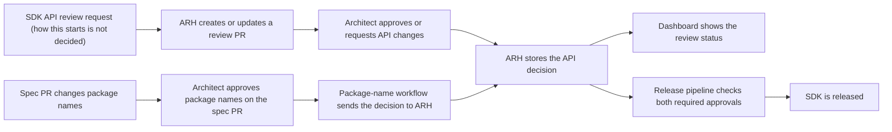

# ARH as the Shared Record for SDK Architecture Approvals

> **Status:** Working draft. This document lists what we already know and the
> questions we still need to answer.

---

## Goal

Use API Review Hub (ARH) as the shared record and dashboard for SDK API and
package-name approvals.

The approval actions remain in the GitHub PR where each review happens:

- Architects approve the SDK API on the ARH review PR.
- Architects approve package names on the `azure-rest-api-specs` PR. The
  package-name workflow verifies the approver and sends the decision to ARH.

ARH then stores both decisions and makes their status available to GitHub dashboards
and release pipelines.

The new process should:

- keep the release-facing approval records in one place;
- give architects one review dashboard;
- remove duplicate tracking in SDK review issues;
- work for generated and manually written SDKs;
- group related language packages under one service;
- show package names that still need approval and names already approved; and
- block release when the required SDK API or package-name approval is missing.

The expected flow is:

---

## Terms used in this document

- **Working PR:** The SDK pull request that will be merged and released.
- **Review PR:** The pull request created by ARH for reviewing the SDK API. It uses
  temporary branches and does not change the SDK repository. It should be closed,
  not merged.
- **API hash:** An ID for the exact SDK API that was reviewed. If the API changes,
  the hash changes and the old approval no longer applies.
- **SDK review issue:** The current issue in `Azure/azure-sdk` used to collect
  review links, group languages, and show review status.
- **ARH Service and Package:** ARH groups related Packages under a Service. This can
  preserve the cross-language grouping currently provided by one SDK review issue.
- **Status label:** A label such as `api-approved` that ARH writes to GitHub so
  people and dashboards can see the current state. The label is not the official
  approval record.
- **Send a package-name decision to ARH:** After an architect approves on the spec
  PR, the package-name workflow verifies the architect and writes that decision to
  ARH. The architect does not repeat the approval in ARH.

---

## Decisions at a glance

| Area | What we know | What is still open |
|------|--------------|--------------------|
| Approval records | APIView stores SDK API approval today. Package-name approval is enforced on the spec PR. ARH will store both records for release. | Identify anything that must move from APIView or current package-name labels to ARH. |
| SDK review issues | ARH already groups Packages under a Service. | Decide whether the issue is still needed to request a review or communicate with the service team. |
| Architect dashboard | [Project view 4](https://github.com/orgs/Azure/projects/1018/views/4) is the current proof of concept. | Decide the fields, filters, and assignment behavior. |
| Starting a review | No single method has been chosen. | Choose the normal method and a manual backup method. |
| All SDK types | ARH does not depend on TypeSpec or the release agent. | Explain what starts ARH review for manually written or locally generated SDKs. |
| Review PR | ARH creates a review PR linked to the working SDK PR. | Decide when it is updated and closed, and when APIView can be removed. |
| SDK API states | SDK API review happens on the ARH review PR; ARH stores the decision and writes status labels back to GitHub. | Finalize the labels and which GitHub review actions count as an architect decision. |
| Release check | #16660 defines the pipeline and CLI check. | Decide whether language-specific rules should be aligned and when APIView can stop serving as a backup. |
| Package-name approval | Architects continue approving names on the GitHub spec PR; ARH stores the result and the release pipeline checks it. | Decide how existing approvals are imported, when an approval can be reused, and what happens when one language's name changes. |
| Other review boards | ARH covers SDK API and package-name approval records. | Keep Stewardship and Breaking Change review separate. |

---

## 1. Where decisions happen and where they are stored

### What happens today

- APIView is the official SDK API approval record.
- Release pipelines check APIView.
- Labels such as `<lang>-api-approved` on SDK review issues are only status
  information for the service team. Release pipelines do not use them.
- Package-name approval happens on the `azure-rest-api-specs` PR. Protected labels
  and a required GitHub check block the spec PR until the required architects
  approve.

### Proposed change

ARH becomes the shared record used by release pipelines.

For SDK API approval:

- The architect reviews and decides on the ARH review PR.
- ARH stores the API hash, decision, architect, language, package, working SDK PR,
  and decision time.

For package-name approval:

- The architect reviews and approves on the `azure-rest-api-specs` PR.
- The package-name workflow verifies the architect.
- The workflow sends the Service, language, exact package name, architect, decision,
  and decision time to ARH.

ARH makes both results available to the dashboard and release check. GitHub
workflows can use the stored results to update labels, comments, and required checks.
ARH does not ask the architect to approve the package name a second time.

### Questions to answer

- [ ] Besides the release pipeline, does any tool still read SDK API approval from
  APIView or informational GitHub labels?
- [ ] Which tools currently read package-name approval labels and must instead read
  the result stored in ARH?
- [ ] When an approved SDK API changes, should ARH automatically remove the old
  approval and request another review?
- [ ] If ARH cannot be reached during release, should release stop? What approved
  emergency override should exist?
- [ ] How long must ARH keep approval history?

---

## 2. Can SDK review issues be removed?

### What the issue does today

| Purpose | Possible ARH replacement |
|---------|--------------------------|
| Starts the review process | The new review request method |
| Collects and checks review links | ARH links the working PR and review PR |
| Groups languages for one service | ARH Service with child Packages |
| Assigns architects | ARH reviewer assignment |
| Shows approval status | ARH labels and dashboard fields |
| Supports Bookings and scheduled reviews | The new review request method |
| Keeps discussion history | ARH review PR |

The issue has never been the official SDK API approval record. APIView is official
today; ARH will become the release-facing record after the pipeline moves to it.

### Service information that must remain visible

ARH can group child Packages under one Service, but the replacement must still show
the information architects currently get from one multi-language issue:

- service name;
- packages and languages included in the review;
- working SDK PR and ARH review PR for each package;
- assigned architects;
- review status for each package and language;
- links to samples or other supporting material when needed; and
- meeting request and meeting details when the service team needs a live discussion.

### Questions to answer

- [ ] Is the issue still needed to request a review or communicate with the service
  team?
- [ ] For reviews already scheduled through Bookings, do they finish through the
  current issue process or move into ARH?
- [ ] After SDK review issues are removed, how does a service team request a live
  architect meeting when discussion through PR comments is not enough?
- [ ] Where are the meeting date, meeting link, agenda, packages, and outcome
  recorded so architects can find them from the ARH dashboard?
- [ ] After a meeting, is the final approval always recorded in ARH against the API
  hash?
- [ ] Should old issues remain available as read-only history?
- [ ] How long should the old issue process run beside ARH before new issues stop
  being created?

If the issue is still required to request reviews or communicate with the service
team, everyone will still have two places to track the same review.

---

## 3. Architect dashboard

The [ARH project view proof of
concept](https://github.com/orgs/Azure/projects/1018/views/4) should become the
architects' main review list.

It should answer:

- What needs my review?
- Is this an SDK API review or a package-name review?
- What language, package, and service is it for?
- Is it waiting for review, waiting for service-team changes, or approved?
- Where are the review PR and working SDK PR?
- What other packages belong to the same ARH Service?
- Which package names still need approval, and which names were approved earlier?

ARH already groups child Packages under a top-level Service. The dashboard should
use that relationship rather than guess the service from PR titles or labels.

Architects should not need to open Azure DevOps release-plan work items. Release
information may help automation find the correct ARH Service and Package, but that
work item does not need to appear on the dashboard.

### Questions to answer

- [ ] When a review starts, how does automation find or create the correct ARH
  Service and Package?
- [ ] Which Azure-owned repository will contain the ARH review PRs?
- [ ] Which dashboard fields and filters are required?
- [ ] Does ARH update the dashboard fields directly, or does the dashboard read
  ARH's GitHub labels?
- [ ] How are existing open reviews added to the dashboard?
- [ ] How are package-name reviews on spec PRs linked to the correct ARH Service and
  shown on the dashboard?
- [ ] Should the project contain only SDK Architecture Board work, or should it link
  to separate Stewardship and Breaking Change views?

The GitHub Project status `Done` must not mean API or package-name approval. The
decisions stored in ARH remain the records used for release.

---

## 4. What starts an SDK API review?

No normal method for starting an SDK API review has been selected. Package-name
review has a separate trigger: a new or changed package name on the spec PR.

| Option | Benefit | Drawback |
|--------|---------|----------|
| Label on the working SDK PR | Simple and works for any SDK PR | Someone must remember to add it |
| Guidance in the release planner | Includes service and release information | The dashboard is read-only; the service team must copy and run an Azure SDK agent request |
| `azsdk` or Azure SDK agent request | Explicit and works outside the release planner | Service teams must know what to run |
| Automatic release-readiness event | Requires the least service-team work | The event and the SDK paths it covers have not been defined |

### Questions to answer

- [ ] Which option is the normal path?
- [ ] If the normal path is automatic, which event starts it?
- [ ] What is the manual backup when automation does not apply?
- [ ] Who may start, cancel, or restart a review?
- [ ] When the SDK PR changes, does ARH update the same review PR?
- [ ] How does ARH close reviews that are abandoned or replaced?

All entry points should call the same ARH operation so they create or update the
same review instead of creating duplicates.

---

## 5. Manually written and locally generated SDKs

ARH already supports SDK API review without TypeSpec or the release agent. It needs
a working SDK PR, language, package, ARH Service, and API information.

The open question is not whether ARH supports these SDKs. The question is what asks
ARH to create the review.

### SDK paths that need a clear answer

- management-plane SDKs generated after spec merge;
- data-plane SDKs generated on request;
- SDKs generated on a developer's machine;
- manually written SDKs;
- releases with no spec change; and
- team-specific handoff flows such as Storage.

### Questions to answer

- [ ] What starts ARH review today for a manually written or locally generated SDK
  PR?
- [ ] Should those paths use the same normal trigger or the manual backup from the
  previous section?
- [ ] What information must the caller provide when there is no release plan?
- [ ] Can every SDK path already produce the API file and hash that ARH needs?

---

## 6. What architects review

### Today

Architects review an APIView revision in the APIView website.

### With ARH

ARH creates a review PR containing the SDK API diff and links it to the working SDK
PR. The review PR uses temporary branches, so merging it has no effect on the SDK
code. It should be closed instead.

The intended model is one ARH review PR for one working SDK PR. When the SDK API
changes, ARH updates that review rather than creating unrelated review PRs.

### Questions to answer

- [ ] Does each working SDK PR always use one ARH review PR?
- [ ] What API version is used as the comparison point for the diff?
- [ ] What closes the review PR: approval, SDK PR merge, release, replacement, or
  abandonment?
- [ ] How are existing comments handled when the API diff changes?
- [ ] Does any SDK path still need APIView after ARH is available?

---

## 7. SDK API states and GitHub labels

The SDK API approval action happens on the ARH review PR in GitHub. ARH checks
whether the reviewer is an authorized architect, stores the decision for the current
API hash, and writes the status back to GitHub.

| ARH decision | Proposed GitHub label | Meaning |
|--------------|-----------------------|---------|
| Review needed | `api-review-needed` | An architect still needs to review this API |
| Changes requested | `api-changes-requested` | An architect asked the service team to change the API |
| Approved | `api-approved` | An architect approved the current API hash |

Only one of these labels should be present at a time. If the API hash changes,
`api-approved` must be removed.

A normal implementation approval from an SDK maintainer is not automatically an API
approval. ARH should count only decisions made by an authorized architect on the ARH
review PR.

### Questions to answer

- [ ] Are these the final label names?
- [ ] Do any language repositories already use these names differently?
- [ ] Does a normal GitHub "Request changes" review set
  `api-changes-requested`, or is a separate ARH action needed?
- [ ] Where is the list of authorized architects stored, and how are backup
  reviewers handled?
- [ ] Do the status labels need to appear on both the ARH review PR and the working
  SDK PR?

---

## 8. Release pipeline

[#16660](https://github.com/Azure/azure-sdk-tools/pull/16660) defines the release
check:

1. Each language pipeline runs `azsdk package get-approval-status` at its existing
   approval-check step.
2. For repositories using ARH, the package information includes the exact API hash
   produced for that release.
3. During migration, packages without an ARH hash are checked in APIView instead.
4. The pipeline fails when a package is not approved or the check cannot be
   completed.
5. An authorized `Skip.CheckPackageApproval` setting is the emergency override.
6. After publishing, `azsdk package mark-released` records that the package was
   released.

This release check does not decide what starts the ARH review. It only verifies the
approval before release. In the target design, ARH returns the package's combined
release status, including required SDK API and package-name approvals.

### Questions to answer

- [ ] Do all language pipelines need the same rules for when this check runs?
- [ ] What must be completed before every package is required to have an ARH hash
  and APIView can stop serving as a backup?

---

## 9. Recording package-name approval in ARH

### What happens today

The [current package-name review
process](https://github.com/samvaity/azure-rest-api-specs/blob/bbd22cbebd12870570ea5795ff10c45ae5b83522/.github/workflows/src/package-name-approval/PACKAGE-NAME-REVIEW-PROCESS.md)
runs on the GitHub spec PR:

- A workflow finds new or changed package names in `tspconfig.yaml`.
- If any package name changes, all Tier 1 language architects must approve the
  cross-language package-name set.
- The PR comment shows names that changed, names that are configured but unchanged,
  and languages that are not yet configured.
- Architects approve by applying protected GitHub labels.
- A required GitHub check blocks the spec PR until all required approvals are
  present.
- If a name changes again on the same PR, only that language's earlier approval is
  removed. Unchanged approvals are kept.

This process blocks the spec PR. It is separate from the later SDK API review.

### Proposed ARH integration

GitHub remains where architects review and approve package names. The workflow also
sends each decision to ARH so ARH can keep the long-term record and expose it to the
release pipeline.

When a spec PR opens or changes, the package-name workflow asks ARH whether each
exact package name was approved earlier. The GitHub comment then shows whether the
architect must act:

The package-name table could show:

| State | Display | Architect action |
|-------|---------|------------------|
| New, changed, or not approved in ARH | Pending | Review and approve on the GitHub spec PR |
| Exact package name already approved in ARH | Approved, greyed out | No action unless the full cross-language set must be approved again |
| Language not configured | Not configured, greyed out | Decision needed |

After approval:

1. The architect approves on the GitHub spec PR.
2. The workflow verifies that the architect may approve that language.
3. The workflow records the Service, language, exact package name, architect, and
   decision in ARH.
4. ARH returns the stored status to the workflow so the GitHub comment and required
   check reflect the result.
5. The release pipeline checks both package-name approval and SDK API approval
   through ARH.

### Questions to answer

- [ ] What exactly identifies a reusable package-name approval: ARH Service,
  language, and exact package name, or are more fields needed?
- [ ] How are package names approved before ARH imported? Should package names
  already merged to the main branch start as approved, or must they be reviewed once
  in ARH?
- [ ] If one language's package name changes, must every Tier 1 language approve the
  full set again, as they do today?
- [ ] If all Tier 1 architects must approve again, how should a greyed-out,
  previously approved name show that a new cross-language confirmation is still
  needed?
- [ ] What does an architect approve for a Tier 1 language that is not yet
  configured?
- [ ] When an exact package name changes, does ARH keep the old approval as history
  while marking only the new name as pending?
- [ ] Are protected labels still how the architect approves on the spec PR? If not,
  what GitHub action replaces them before the verified decision is sent to ARH?
- [ ] How does the package-name workflow find or create the correct ARH Service and
  Package?

---

## 10. What ARH does not replace

Laurent's process describes three separate review groups:

1. Breaking Change Board
2. Stewardship Board
3. SDK Architecture Board

This work replaces the SDK Architecture Board's APIView and SDK review issue flow.
It also stores package-name decisions in ARH, but it does not move the package-name
approval action away from the GitHub spec PR.

| ARH covers | Separate process |
|------------|------------------|
| SDK public API review | Data-plane specification review by the Stewardship Board |
| SDK API review PR | Breaking-change approval |
| SDK architect assignment and decision | ARM and other specification review |
| API approval for the exact API hash | General SDK code review |
| Package-name approval record | The package-name review action on the GitHub spec PR |
| SDK Architecture Board dashboard | Other release approvals |

The architect dashboard may show package-name reviews as a separate view, but
Stewardship and Breaking Change review remain separate processes.
